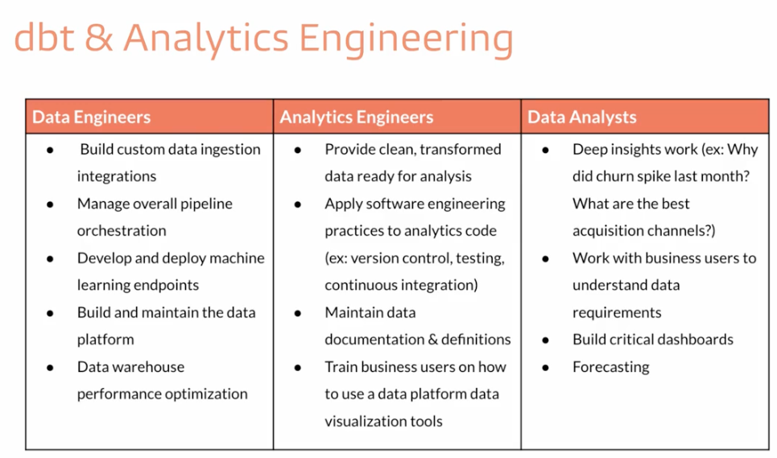

# 0 - dbt Fundamentals

# **1 - Welcome to dbt Fundamentals**

Don’t have any info

---

# 2 - **Who is an Analytics Engineer?**

- Explain the structure of traditional data teams.
    - A data engineer, much closer to data orchestration
    - A data analyst, closer to the business areas
- Explain how advances in technology enabled the transition from ETL to ELT.
    - ETL: Extract, Transform and Load:
    - ELT: Extract, Load and Transform:
    - Data WareHouse: Combine a DataBase and a super computer for transforming data. Made the change from ETL to ELT possible
- Explain the role of analytics engineer and the modern data team.
    - With ELT, Data Engineers aren't responsible to transform the data anymore. They just Extract and Load
    - The Analytics Engineer are now the ones responsible for transforming the data
    - The Data Analyst are the ones that still closer to business decisions, but they now have someone to talk to and work in a much faster way
    
    
    
- Explain how dbt fits into the modern data stack.
- Understand the structure of a dbt project.

## Review

### **Traditional Data Teams**

- Data engineers are responsible for maintaining data infrastructure and the ETL process for creating tables and views.
- Data analysts focus on querying tables and views to drive business insights for stakeholders.

### **ETL and ELT**

- ETL (extract transform load) is the process of creating new database objects by extracting data from multiple data sources, transforming it on a local or third party machine, and loading the transformed data into a data warehouse.
- ELT (extract load transform) is a more recent process of creating new database objects by first extracting and loading raw data into a data warehouse and then transforming that data directly in the warehouse.
- The new ELT process is made possible by the introduction of cloud-based data warehouse technologies.

### **Analytics Engineering**

- Analytics engineers focus on the transformation of raw data into transformed data that is ready for analysis. This new role on the data team changes the responsibilities of data engineers and data analysts.
- Data engineers can focus on larger data architecture and the EL in ELT.
- Data analysts can focus on insight and dashboard work using the transformed data.
- Note: At a small company, a data team of one may own all three of these roles and responsibilities. As your team grows, the lines between these roles will remain blurry.

### **dbt**

- dbt empowers data teams to leverage software engineering principles for transforming data.

---

# 3 - **Set Up dbt Cloud**

- Load training data into your data platform
- Set up an empty repository and connect your GitHub account to dbt Cloud.
- Set up your warehouse and repository connections.
- Navigate the dbt Cloud IDE.
- Complete a simple development workflow in the dbt Cloud IDE.

---

# 4 - **Models**

### **Models**

- Models are .sql files that live in the models folder.
- Models are simply written as select statements - there is no DDL/DML that needs to be written around this. This allows the developer to focus on the logic.
- In the Cloud IDE, the Preview button will run this select statement against your data warehouse. The results shown here are equivalent to what this model will return once it is materialized.
- After constructing a model, `dbt run` in the command line will actually materialize the models into the data warehouse. The default materialization is a view.
- The materialization can be configured as a table with the following configuration block at the top of the model file:

```yaml
{{ config(
materialized='table'
) }}
```

- The same applies for configuring a model as a view:

```yaml
{{ config(
materialized='view'
) }}
```

- When `dbt run` is executing, dbt is wrapping the select statement in the correct DDL/DML to build that model as a table/view. If that model already exists in the data warehouse, dbt will automatically drop that table or view before building the new database object. *Note: If you are on BigQuery, you may need to run `dbt run --full-refresh` for this to take effect.
- The DDL/DML that is being run to build each model can be viewed in the logs through the cloud interface or the target folder.


### **Modularity**

- We could build each of our final models in a single model as we did with dim_customers, however with dbt we can create our final data products using modularity.
- **Modularity** is the degree to which a system's components may be separated and recombined, often with the benefit of flexibility and variety in use.
- This allows us to build data artifacts in logical steps.
- For example, we can stage the raw customers and orders data to shape it into what we want it to look like. Then we can build a model that references both of these to build the final dim_customers model.
- Thinking modularly is how software engineers build applications. Models can be leveraged to apply this modular thinking to analytics engineering.

### ref Macro

- Models *can* be written to reference the underlying tables and views that were building the data warehouse (e.g. `analytics.dbt_jsmith.stg_jaffle_shop_customers`). This hard codes the table names and makes it difficult to share code between developers.
- The `ref` function allows us to build dependencies between models in a flexible way that can be shared in a common code base. The `ref`function compiles to the name of the database object as it has been created on the most recent execution of `dbt run` *in the particular development environment.* This is determined by the environment configuration that was set up when the project was created.
- Example: `{{ ref('stg_jaffle_shop_customers') }}` compiles to `analytics.dbt_jsmith.stg_jaffle_shop_customers`.
- The `ref` function also builds a lineage graph like the one shown below. dbt is able to determine dependencies between models and takes those into account to build models in the correct order.


### **Modeling History**

- There have been multiple modeling paradigms since the advent of database technology. Many of these are classified as normalised modeling.
- Normalised modeling techniques were designed when storage was expensive and computational power was not as affordable as it is today.
- With a modern cloud-based data warehouse, we can approach analytics differently in an *agile* or *ad hoc* modeling technique. This is often referred to as denormalized modeling.
- dbt can build your data warehouse into any of these schemas. dbt is a tool for *how* to build these rather than enforcing *what* to build.

### **Naming Conventions**

In working on this project, we established some conventions for naming our models.

- **Sources** (`src`) refer to the raw table data that have been built in the warehouse through a loading process. (We will cover configuring Sources in the Sources module)
- **Staging** (`stg`) refers to models that are built directly on top of sources. These have a one-to-one relationship with sources tables. These are used for very light transformations that shape the data into what you want it to be. These models are used to clean and standardize the data before transforming data downstream. Note: These are typically materialized as views.
- **Intermediate** (`int`) refers to any models that exist between final fact and dimension tables. These should be built on staging models rather than directly on sources to leverage the data cleaning that was done in staging.
- **Fact** (`fct`) refers to any data that represents something that occurred or is occurring. Examples include sessions, transactions, orders, stories, votes. These are typically skinny, long tables.
- **Dimension** (`dim`) refers to data that represents a person, place or thing. Examples include customers, products, candidates, buildings, employees.
- Note: The Fact and Dimension convention is based on previous normalized modeling techniques.

### **Reorganize Project**

- When `dbt run` is executed, dbt will automatically run every model in the models directory.
- The subfolder structure within the models directory can be leveraged for organizing the project as the data team sees fit.
- This can then be leveraged to select certain folders with `dbt run` and the model selector.
- Example: If `dbt run -s staging` will run all models that exist in `models/staging`. (Note: This can also be applied for `dbt test`as well which will be covered later.)
- The following framework can be a starting part for designing your own model organization:
- **Marts** folder: All intermediate, fact, and dimension models can be stored here. Further subfolders can be used to separate data by business function (e.g. marketing, finance)
- **Staging** folder: All staging models and source configurations can be stored here. Further subfolders can be used to separate data by data source (e.g. Stripe, Segment, Salesforce). (We will cover configuring Sources in the Sources module)


---

# 5 - **Sources**

### **Sources**

- Sources represent the raw data that is loaded into the data warehouse.
- We *can* reference tables in our models with an explicit table name (`raw.jaffle_shop.customers`).
- However, setting up Sources in dbt and referring to them with the `source`function enables a few important tools.
    - Multiple tables from a single source can be configured in one place.
    - Sources are easily identified as green nodes in the Lineage Graph.
    - You can use `dbt source freshness` to check the freshness of raw tables.

### **Configuring sources**

- Sources are configured in YML files in the models directory.
- The following code block configures the table `raw.jaffle_shop.customers` and `raw.jaffle_shop.orders`:

```yaml
version: 2

sources:
  - name: jaffle_shop
    database: raw
    schema: jaffle_shop
    tables:
      - name: customers
      - name: orders
```

- View the full documentation for configuring sources on the [source properties](https://docs.getdbt.com/reference/source-properties) page of the docs.

### **Source function**

- The `ref` function is used to build dependencies between models.
- Similarly, the `source` function is used to build the dependency of one model to a source.
- Given the source configuration above, the snippet `{{ source('jaffle_shop','customers') }}` in a model file will compile to `raw.jaffle_shop.customers`.
- The Lineage Graph will represent the sources in green.


### **Source freshness**

- Freshness thresholds can be set in the YML file where sources are configured. For each table, the keys `loaded_at_field` and `freshness` must be configured.

```yaml
version: 2

sources:
  - name: jaffle_shop
    database: raw
    schema: jaffle_shop
    tables:
      - name: orders
        loaded_at_field: _etl_loaded_at
        freshness:
          warn_after: {count: 12, period: hour}
          error_after: {count: 24, period: hour}
```

- A threshold can be configured for giving a warning and an error with the keys `warn_after` and `error_after`.
- The freshness of sources can then be determined with the command `dbt source freshness`.

---

# 6 - **Tests**

### **Testing**

- **Testing** is used in software engineering to make sure that the code does what we expect it to.
- In Analytics Engineering, testing allows us to make sure that the SQL transformations we write produce a model that meets our assertions.
- In dbt, tests are written as select statements. These select statements are run against your materialized models to ensure they meet your assertions.

### **Tests in dbt**

- In dbt, there are two types of tests - generic tests and singular tests:
    - **Generic tests** are a way to validate your data models and ensure data quality. These tests are predefined and can be applied to any column of your data models to check for common data issues. They are written in YAML files.
    - **Singular tests** are data tests defined by writing specific SQL queries that return records which fail the test conditions. These tests are referred to as "singular" because they are one-off assertions that are uniquely designed for a single purpose or specific scenario within the data models.
- dbt ships with four built in tests: unique, not null, accepted values, relationships.
    - **Unique** tests to see if every value in a column is unique
    - **Not_null** tests to see if every value in a column is not null
    - **Accepted_values** tests to make sure every value in a column is equal to a value in a provided list
    - **Relationships** tests to ensure that every value in a column exists in a column in another model (see: [referential integrity](https://en.wikipedia.org/wiki/Referential_integrity))
- Tests can be run against your current project using a range of commands:
    - `dbt test` runs all tests in the dbt project
    - `dbt test --select test_type:generic`
    - `dbt test --select test_type:singular`
    - `dbt test --select one_specific_model`
- Read more here in [testing documentation](https://docs.getdbt.com/reference/node-selection/test-selection-examples).
- In development, dbt Cloud will provide a visual for your test results. Each test produces a log that you can view to investigate the test results further.


In production, dbt Cloud can be scheduled to run `dbt test`. The ‘Run History’ tab provides a similar interface for viewing the test results.


You've learned about the 4 built-in generic tests, but there are so many more tests in packages you could be using! Learn about them in our free online course on [Jinja, Macros, and Packages.](https://learn.getdbt.com/courses/jinja-macros-and-packages)

Do you want to take your testing knowledge to the next level? Check out our free online course on [Advanced Testing](https://courses.getdbt.com/courses/advanced-testing)!

---

# 7 - **Documentation**

### **Documentation**

- Documentation is essential for an analytics team to work effectively and efficiently. Strong documentation empowers users to self-service questions about data and enables new team members to on-board quickly.
- Documentation often lags behind the code it is meant to describe. This can happen because documentation is a separate process from the coding itself that lives in another tool.
- Therefore, documentation should be as automated as possible and happen as close as possible to the coding.
- In dbt, models are built in SQL files. These models are documented in YML files that live in the same folder as the models.

### **Writing documentation and doc blocks**

- Documentation of models occurs in the YML files (where generic tests also live) inside the models directory. It is helpful to store the YML file in the same subfolder as the models you are documenting.
- For models, descriptions can happen at the model, source, or column level.
- If a longer form, more styled version of text would provide a strong description, **doc blocks** can be used to render markdown in the generated documentation.
    - It starts with `` and ends with ``
    - It should be referenced by the name only like: `{{ doc('order_status') }}`

### **Generating and viewing documentation**

- In the command line section, an updated version of documentation can be generated through the command `dbt docs generate`. This will refresh the `view docs` link in the top left corner of the Cloud IDE.
- The generated documentation includes the following:
    - Lineage Graph
    - Model, source, and column descriptions
    - Generic tests added to a column
    - The underlying SQL code for each model
    - and more...

---

# 8 - **Deployment**

### **Development vs. Deployment**

- Development in dbt is the process of building, refactoring, and organizing different files in your dbt project. This is done in a development environment using a development schema (`dbt_jsmith`) and typically on a *non-default* branch (i.e. feature/customers-model, fix/date-spine-issue). After making the appropriate changes, the development branch is merged to main/master so that those changes can be used in deployment.
- Deployment in dbt (or running dbt in production) is the process of running dbt on a schedule in a deployment environment. The deployment environment will typically run from the *default* branch (i.e., main, master) and use a dedicated deployment schema (e.g., `dbt_prod`). The models built in deployment are then used to power dashboards, reporting, and other key business decision-making processes.
- The use of development environments and branches makes it possible to continue to build your dbt project *without* affecting the models, tests, and documentation that are running in production.

### **Creating your Deployment Environment**

- A deployment environment can be configured in dbt Cloud on the Environments page.
- **General Settings:** You can configure which dbt version you want to use and you have the option to specify a branch other than the default branch.
- **Data Warehouse Connection:** You can set data warehouse specific configurations here. For example, you may choose to use a dedicated warehouse for your production runs in Snowflake.
- **Deployment Credentials:**Here is where you enter the credentials dbt will use to access your data warehouse:
    - IMPORTANT: When deploying a real dbt Project, you should set up a **separate data warehouse account** for this run. This should not be the same account that you personally use in development.
    - IMPORTANT: The schema used in production should be **different** from anyone's development schema.

### **Scheduling a job in dbt Cloud**

- Scheduling of future jobs can be configured in dbt Cloud on the Jobs page.
- You can select the deployment environment that you created before or a different environment if needed.
- **Commands:** A single job can run multiple dbt commands. For example, you can run `dbt run` and `dbt test` back to back on a schedule. You don't need to configure these as separate jobs.
- **Triggers:** This section is where the schedule can be set for the particular job.
- After a job has been created, you can manually start the job by selecting `Run Now`

### **Reviewing Cloud Jobs**

- The results of a particular job run can be reviewed as the job completes and over time.
- The logs for each command can be reviewed.
- If documentation was generated, this can be viewed.
- If `dbt source freshness` was run, the results can also be viewed at the end of a job.

Curious to know more about deploying with dbt Cloud? Check out our free online [Advanced Deployment course](https://courses.getdbt.com/courses/advanced-deployment), where you'll learn how to deploy your dbt Cloud project with advanced functionality including continuous integration, orchestrating conflicting jobs, and customizing behavior by environment!

Want to know how to automate and accelerate your dbt workflow? Learn how with our free online course on [Webhooks](https://courses.getdbt.com/courses/webhooks)!

---

# 9 - All questions

### **1 - Welcome to dbt Fundamentals**

Didn't have any

### 2 - **Who is an Analytics Engineer?**


---


---


---


---

### 3 - **Set Up dbt Cloud**


---


---


---


---

### 4 - **Models**


---


---


---


---


---


---


---


---

### 5 - **Sources**


---


---


---


---


---


---

### **6 - Tests**

---


---


---


---


---


---


---


---


---

### 7 - **Documentation**


---


---


---


---

### 8 - **Deployment**


---


---


---


---


---
