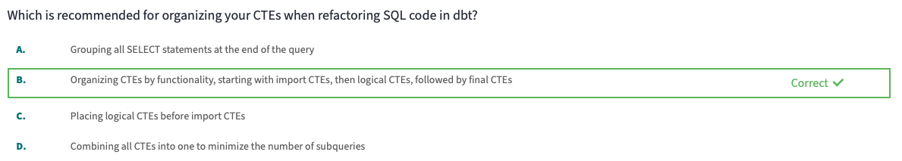

# 1 - Refactoring SQL for Modularity

Migrate legacy code into modular dbt data models with guidance from dbt Labs experts. Port stored procedures or SQL scripts into your dbt cloud project for efficient and scalable transformations.

---

# Part 1: Learn the refactoring process

### Learning Objectives

- Identify and explain the importance of SQL refactoring, specifically in the context of improving model maintainability.
- Analyze existing SQL scripts and identifying areas where cosmetic cleanups and CTE groupings can improve readability and maintainability.

### Steps to refactoring Legacy Code

1. Migrating legacy code
    
    Just copy and past the old code into a new dbt model
    
2. Translating hard coded table references
    
    Instead of hard-coded table names, use reffs (table_name) or source (source_name, table_name) macros
    
3. Choosing a refactoring strategy
4. CTE groupings and cosmetic cleanups
    
    It will depend on the model but its basically dividing the old SQL into CTEs, different models, best practices, etc.
    
    CTEs structure: 
    
    1. import CTEs
    2. logical CTEs
    3. final CTE
    4. simple select statement
5. Centralising transformations and splitting up models
    1. Staging models
    2. CTEs or Intermediate models
    3. Final model
6. Auditing
    
    Using DBT audit helper. 
    

### Questions

---

---

---

---

# Part 2: Practice refactoring

Nothing to really add here. Its the same thing as before.

[Refactoring_SQL_for_Modularity.pdf](images/images_1/Refactoring_SQL_for_Modularity.pdf)
