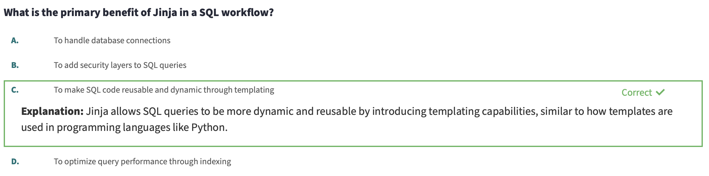

# 2 - Jinja, Macros, and Packages

**Course**

Extend the functionality of dbt with Jinja/macros and leverage models and macros from packages.

# **Getting started with Jinja**

### **Learning Objectives**

- Explain how Jinja works as a templating language.
- Anticipate the output of a block of Jinja code.
- Refactor a pivot query using Jinja.

### **Jinja**

Jinja a templating language written in the python programming language. Jinja is used in dbt to write functional SQL. For example, we can write a dynamic pivot model using Jinja.

### **Jinja Basics**

The best place to learn about leveraging Jinja is the [Jinja Template Designer documentation](https://jinja.palletsprojects.com/page/templates/).

There are three Jinja delimiters to be aware of in Jinja.

- `` is used for statements. These perform any function programming such as setting a variable or starting a for loop.
- `{{ … }}` is used for expressions. These will print text to the rendered file. In most cases in dbt, this will compile your Jinja to pure SQL.
- `{# … #}` is used for comments. This allows us to document our code inline. This will not be rendered in the pure SQL that you create when you run dbt compile or dbt run.

A few helpful features of Jinja include dictionaries, lists, if/else statements, for loops, and macros.

**Dictionaries** are data structures composed of key-value pairs.

```


{{ person.name }}

me

{{ person[‘number’] }}

3
```

**Lists** are data structures that are ordered and indexed by integers.

```


{{ self[0] }}

me
```

**If/else statements** are control statements that make it possible to provide instructions for a computer to make decisions based on clear criteria.

```


On a day like this, I especially like



a refreshing mango sorbet.



A decadent chocolate ice cream.



On a day like this, I especially like

a refreshing mango sorbet
```

**For loops** make it possible to repeat a code block while passing different values for each iteration through the loop.

```




Today I want {{ flavor }} ice cream!



Today I want chocolate ice cream!

Today I want vanilla ice cream!

Today I want strawberry ice cream!

```

**Macros** are a way of writing functions in Jinja. This allows us to write a set of statements once and then reference those statements throughout your code base.

```


Today I want {{ flavor }} {{ dessert }}!



{{ hoyquiero(flavor = ‘chocolate’) }}

Today I want chocolate ice cream!

{{ hoyquiero(mango, sorbet) }}

Today I want mango sorbet!
```

### **Whitespace Control**

We can control for whitespace by adding a single dash on either side of the Jinja delimiter. This will trim the whitespace between the Jinja delimiter on that side of the expression.

### **Bringing it all Together!**

We saw that we could refactor the following pivot model in pure SQL using Jinja to make it more dynamic to pivot on a list of payment methods.

**Original SQL:**

```sql
with payments as (
   select * from {{ ref('stg_payments') }}
),

final as (
   select
       order_id,

       sum(case when payment_method = 'bank_transfer' then amount else 0 end) as bank_transfer_amount,
       sum(case when payment_method = 'credit_card' then amount else 0 end) as credit_card_amount,
       sum(case when payment_method = 'coupon' then amount else 0 end) as coupon_amount,
       sum(case when payment_method = 'gift_card' then amount else 0 end) as gift_card_amount

   from <code class="language-sql">payments</code>

   group by 1
)

select * from final
```

**Refactored Jinja + SQL:**

```sql


with payments as (
   select * from {{ ref('stg_payments') }}
),

final as (
   select
       order_id,
       

       sum(case when payment_method = '{{ payment_method }}' then amount else 0 end)
            as {{ payment_method }}_amount

       
         ,
       

       
   from <code class="language-sql">payments</code>
   group by 1
)

select * from final
```

### Questions

---



---


---


---

# **Working with Macros**

### **Learning Objectives**

- Explain the role of macros in a dbt project.
- Define macros in the `macros` folder.
- Add macros to models.
- Write a macro for converting from cents to dollars.
- Write a macro for limiting data in development.
- Negotiate the balance between readability and DRY-ness.

### **Macros**

**Macros** are functions that are written in Jinja. This allows us to write generic logic once, and then reference that logic throughout our project.

Consider the case where we have three models that use the same logic. We could copy paste the logic between those three models. If we want to change that logic, we need to make the change in three different places.

Macros allow us to write that logic once in one place and then reference that logic in those three models. If we want to change the logic, we make that change in the definition of the macro and this is automatically used in those three models.

### **DRY Code**

Macros allow us to write DRY (Don’t Repeat Yourself) code in our dbt project. This allows us to take one model file that was 200 lines of code and compress it down to 50 lines of code. We can do this by abstracting away the logic into macros.

### **Tradeoff**

As you work through your dbt project, it is important to balance the readability/maintainability of your code with how concise your code (or DRY) your code is. Always remember that you are not the only one using this code, so be mindful and intentional about where you use macros.

### **Macro Example: Cents to Dollars**

**Original Model:**

```sql
select
    id as payment_id,
    orderid as order_id,
    paymentmethod as payment_method,
    status,
    -- amount stored in cents, convert to dollars
    amount / 100 as amount,
    created as created_at
from {{ source(‘stripe’, ‘payment’) }}

```

**New Macro:**

```sql

round( 1.0 * {{ column_name }} / 100, {{ decimal_places }})


```

**Refactored Model:**

```sql
select
    id as payment_id,
    orderid as order_id,
    paymentmethod as payment_method,
    status,
    -- amount stored in cents, convert to dollars
    {{ cents_to_dollars(‘payment_amount’) }} as amount
    created as created_at
from {{ source(‘stripe’, ‘payment’) }}
```

### Questions

---


---


---


---

# **Packages**

### **Learning objectives**

- Explain the role of packages in a dbt project.
- Install a package from [hub.getdbt.com](https://hub.getdbt.com/).
- Use models and macros from a package.

### **Packages**

**Packages** are a tool for importing models and macros into your dbt Project. These may have been written in by a coworker or someone else in the dbt community that you have never met. Fishtown Analytics maintains a site called [hub.getdbt.com](https://hub.getdbt.com/) for sharing open-source packages that you can install in your project. Packages can also be imported directly from GitHub, GitLab, or another site or from a subfolder in your dbt project.

### **Installing Packages**

- Packages are configured in the root of your dbt project in a file called `packages.yml`.
- You can adjust the version to be compatible with your working version of dbt. Read the packages documentation to determine the version to use.
- Packages are then installed with the command `dbt deps`.

**Example: Adding dbt_utils and snowflake_spend to your dbt project**

**packages.yml**

```yaml
packages:
  - package: dbt-labs/dbt_utils
    version: 0.7.1
  - package: gitlabhq/snowflake_spend
    version: 1.2.0
```

`dbt deps`

### **Using Macros from a Package**

- After importing a package, your dbt project now has access to all the macros from that package.
- The documentation of that particular package is the best place to learn how to use those packages.
- When you want to reference a macro in a package, you must reference that package and then select the particular macro. (e.g. `dbt_utils.date_spine`)

**Example - The following snippet will reference the dbt_utils package and use the date_spine macro.**

```sql
{{ dbt_utils.date_spine(
    datepart=”day”
    start_date=”to_date(‘01/01/2016’, ‘mm/dd/yyyy’)”,
    end_date=”dateadd(week, 1, current_date)”
    )
}}
```

### **Using Models from a Package**

- After importing a package, your dbt project now has access to all the models from that package.
- The documentation of that particular packages is the best place to learn how to use those packages.
- Those models will then become part of your dbt project. They will be build when you run dbt run and can be viewed in documentation as part of your DAG and text-based documentation as well.

**Example - The following DAG below shows all of the snowflake_spend model in gray**


### Questions


---


---


---

# **Advanced Jinja and Macros**

### **Learning objectives**

- Build a macro to grant permissions using the run_query macro, log macro, and target variable
- Build a macro to union tables by a common prefix using the execute variable, agate file types, and get_relations_by_prefix macro
- Build a macro to clean up stale models in the target schema using the information schema

Check out the quick summary of this chapter of the course below. You can also reference Dave's work in the GitHub repository here: [dbt-learn-jinja repository](https://github.com/dbt-labs/dbt-learn-jinja)

### **Grant permissions macro**

**([view code in GitHub](https://github.com/dbt-labs/dbt-learn-jinja/blob/main/macros/grant_select.sql))**

We can run queries against the database when calling a macro. In Dave’s example, he walked through how to use a macro to execute multiple permissions statements in a parameterized way. He leveraged the following dbt specific Jinja functions to do so:

**run_query ([documentation](https://docs.getdbt.com/reference/dbt-jinja-functions/run_query))**

The run_query macro provides a convenient way to run queries and fetch their results. It is a wrapper around the [statement block](https://docs.getdbt.com/reference/dbt-jinja-functions/statement-blocks), which is more flexible, but also more complicated to use.

**log ([documentation](https://docs.getdbt.com/reference/dbt-jinja-functions/log))**

The log macro is used to log a line of text to the logs in dbt. We can add the key default=True to also log the same text to the command line interface.

**target ([documentation](https://docs.getdbt.com/reference/dbt-jinja-functions/target))**

Target contains information about your connection to the warehouse. The variables accessible within the target variable for all adapters include profile_name, name, schema, type, and threads. Check out the documentation for adapter specific variables

### **Union by prefix macro**

**([view code in GitHub](https://github.com/dbt-labs/dbt-learn-jinja/blob/main/macros/union_tables_by_prefix.sql))**

We can also use the results of a query to template the SQL we are writing in a model file. In Dave’s example, he walked through the use of the execute variable, agate file types, and the get_relations_by_prefix macro

**execute ([documentation](https://docs.getdbt.com/reference/dbt-jinja-functions/execute))**

The execute variable is a boolean variable that is true when dbt compiles each node of your project. This can be helpful to wrap around a block of text that you want to *only* run in the execution phase. Check out the docs linked above for a concrete example and additional context.

**agate file types ([documentation](https://agate.readthedocs.io/en/latest/api/table.html))**

When executing the run_query macro, the results of the query are stored in a file type called agate. If you are familiar with pandas in python, this works in a very similar fashion. Check out the documentation linked above for interacting with agate types.

**get_relations_by_prefix ([documentation](https://github.com/dbt-labs/dbt-utils#get_relations_by_prefix-source))**

The get_relations_by_prefix macro can be imported into your project through the dbt_utils package. This works by parsing through the dbt project and looking for relations with a similar prefix. These relations are returned in the form of a list. Check out the documentation linked above for additional ways to leverage this macro.

### **Clean stale models macro**

**([view code in GitHub](https://github.com/dbt-labs/dbt-learn-jinja/blob/main/macros/clean_stale_models.sql))**

Dave walks through an example of using all the tools in the previous lesson to clean up his development schema for any stale models that haven’t been altered in the past 7 days. This macro was built using the information schema in Snowflake and this can be replicated on other data platforms using the respective information schemas. Read more about the origin of this macro in the Discourse post below:

**Discourse:** [Clean your warehouse of old and deprecated models](https://discourse.getdbt.com/t/clean-your-warehouse-of-old-and-deprecated-models/1547)

### Questions

---


---


---


---


---
