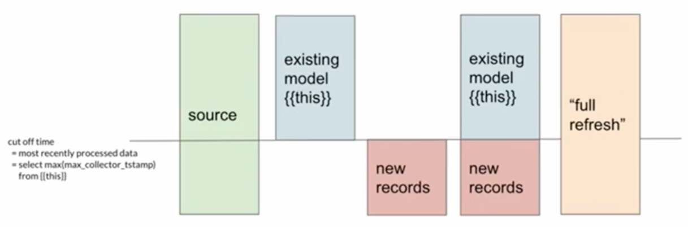

# 3 - Advanced Materializations

**Course**

Learn about the advanced materializations that are built into dbt Core - ephemeral models, incremental models, and snapshots.

# **Materializations**

### **Learning objectives:**

- Explain the five main types of materializations in dbt.
- Configure materializations in configuration files and in models.
- Explain the differences and tradeoffs between tables, views, and ephemeral models.
- Build intuition for incremental models.
- Build intuition for snapshots.

### **Tables**

- Built as tables in the database
- Data is stored on disk
- Slower to build
- Faster to query
- Configure in dbt_project.yml or with the following config block

```sql
{{ config(
    materialized='table'
)}}
```

### **Views**

- Built as views in the database
- Query is stored on disk
- Faster to build
- Slower to query
- Configure in dbt_project.yml or with the following config block

```sql
{{ config(
    materialized='view'
)}}
```

### **Ephemeral Models**

- Does not exist in the database
- Imported as CTE into downstream models
- Increases build time of downstream models
- Cannot query directly
- [Ephemeral Documentation](https://docs.getdbt.com/docs/building-a-dbt-project/building-models/materializations#ephemeral)
- Configure in dbt_project.yml or with the following config block

```sql
{{ config(
    materialized='ephemeral'
)}}
```

### **Incremental Models**

- Built as table in the database
- On the first run, builds entire table
- On subsequent runs, only appends new records*
- Faster to build because you are only adding new records
- Does not capture 100% of the data all the time
- [Incremental Documentation](https://docs.getdbt.com/docs/building-a-dbt-project/building-models/materializations#incremental)
- [Discourse post on Incrementality](https://discourse.getdbt.com/t/on-the-limits-of-incrementality/303)

```sql
{{ config(
    materialized='incremental',
    unique_key = 'unique_column' -- we need this so it wont have duplicates
)}}
.
.
.

	-- WHERE timestamp_column >= (SELECT MAX(max_timestamp_column) FROM {{this}})
	WHERE timestamp_column 
		>= (SELECT DATE_ADD('DAY', -3, MAX(max_timestamp_column)) FROM {{this}})

```

`{{ this }}`  Represents the currently existing database object mapped to this model

`is_incremental()` Checks four conditions and make an incremental run:

1. Does this model already exist as an object in the database?
2. Is that database object a table?
3. Is this model configured with materialized = 'incremental'?
4. Was the `--full-refresh` flag passed to this dbt run?

**with the first WHERE clause:**



**with the second WHERE clause:**


### **Snapshots**

- Built as a table in the database, usually in a dedicated schema.
- On the first run, builds entire table and adds four columns: `dbt_scd_id`, `dbt_updated_at`, `dbt_valid_from`, and `dbt_valid_to`
- In future runs, dbt will scan the underlying data and append new records based on the configuration that is made.
- This allows you to capture historical data
- [Snapshots Documentation](https://docs.getdbt.com/docs/building-a-dbt-project/snapshots)
- Configuration is more advanced in this case. Consult the dbt documentation for writing your first snapshot.

### What to use?

- Start with a view
- When it takes too long to query or is being used in too many places and causing racing conditions, switch to table
- When it takes too long to build, switch to incremental

### **Questions**

---


---


---


---
