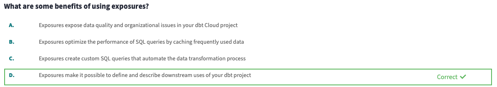

# 5 - Exposures

**Course**

Create visibility of your downstream dependencies using Exposures! Learn how to configure exposures, view exposures, and keep your exposures' dependencies up to date.

### **Learning Objectives**

- Understand the value of creating visibility in the downstream dependencies outside of dbt
- Understand how exposures define downstream use of a dbt resource
- Explain the syntax of an exposure configuration
- Configure exposures using required and expected properties
- Use the “exposure” method in dbt selection syntax
- Identify an exposure in the DAG in both the docs site and the explorer lineage page
- Generate & view exposure documentation.

### Using Exposures

- By defining exposures, you create a clear lineage from your raw data to its downstream end-use cases. Defining exposures lets you:
    - Visualize the downstream resources and processes in your global lineage
    - Run, test, and list resources that feed into your exposure
    - Populate a dedicated page in your documentation (on the docs site and in explorer!) with context relevant to data consumers
- Exposures are configured in `.yml` files inside of your `models/` directory.
- Once you configure an exposure, it will show up as a node in your lineage graph
- Exposures can reference models, metrics, and sources, although we advice you not to reference sources in exposures.
- To run all nodes upstream of an exposure, use the command `dbt run --select +exposure:my_exposure_name`
- To run all nodes upstream of all exposures, use the command `dbt run --select +exposure:*`
- You can view exposures in the docs site after running the command `dbt docs generate`
- You can view exposures configured in your main branch in dbt Explorer after successfully running a production job.

### Questions

---

---

---

---
