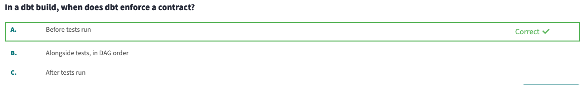

# 6 - dbt Mesh

**Course**

In this course, you’ll learn how to use dbt Mesh to boost data product reliability and development speed, at any scale, without sacrificing governance.

Only model governance would be in the cert. Model contracts, model versions and groups and access modifiers 

# **Model Contracts**

In this lesson we learned that:

- Model contracts guarantee the number of columns, their names and data types for a given table
- With model contracts you can:
    - Ensure the data types of your columns
    - Ensure a model will have a desired shape
    - Apply constraints to your model. (When applying constraints, your data platform will perform additional validations on data as it is being populated. Check our [docs](https://docs.getdbt.com/reference/resource-properties/constraints) to see which constraints your data platform supports.)

Model contracts are configured like so:

```yaml
models:
  - name: model_name
    config:
      contract:
        enforced: true
    columns:
      - name: column_name
        data_type: int
        constraints:
          - type: not_null
      - name: another_column_name
        data_type: string
      ...
```

### Questions

---



---


---


---

# **Model Versions**

In this lesson we learned that:

- Model versions allow you to make breaking changes to a model without actually breaking downstream models.
- Model versions at large organizations are a great way to:
    - Test "prerelease" changes (in production, in downstream systems)
    - Bump the latest version, to be used as the canonical source of truth
    - Offer a migration window off the "old" version

Model versions are configured in yaml files like so:

```yaml
models:
  - name: file_name
    latest_version: 2 #you can specify any version as the latest version
    columns:
      - name: column_name
        data_type: its_data_type
     - name: a_different_column_name
         data_type: that_columns_data_type
    versions:
      - v: 2
      - v: 1
        defined_in: file_name_v1
        config:
          alias: file_name
        columns:
          - include: *
            exclude: a_different_column_name
          - name: a_different_column_name
            data_type: that_columns_data_type
```

### Questions

---


---


---

# **Groups and Access Modifiers**

### **Groups:**

- A group in dbt is a set of resources in your project owned by a person or a team: It’s a set of models that are all related to each other in some way. Each model can only belong to one group.
- Each group has an owner, either one person or a group of people.

Groups are configured like so:

```yaml
groups:
  - name: finance_group
    owner:
      name: Person’s Name
      email: TheirEmail@email.com
  - name: Marketing
    owner:
      name: Marketing Group
      email: marketing@jaffle.com
```

### **Access Modifiers:**

- Access modifiers determine which models can access (reference) a specific model. There are three levels of model access that can be granted.
- Private:
    - Can only be accessed by those in the same group
    - Upstream models that need to be further transformed before they’re ready for downstream consumption
- Protected:
    - Can only be accessed by those in the same project/package (by default, all models are ‘protected’. This means that other models in the same project can reference them.)
    - Also upstream models.
- Public:
    - Anyone can access
    - Will enable multi-project collaboration.
    - Ready for downstream consumption
    - Probably a marts model or a staging model referenced in other projects.

Access modifiers are configured like so:

```yaml
models:
    - name: model_name
         group: group_name
         access: access_modifer #public, private, or protected
```

### Questions

---


---


---

<not doing the “Multi-Project” part since it wont be covered in the exam>
