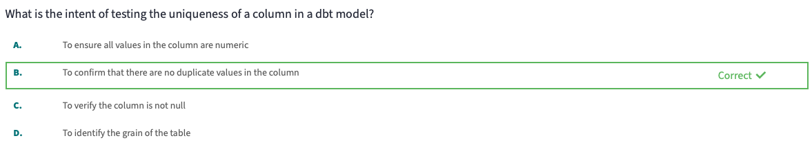

# 7 - Advanced Testing

# **Introduction to Advanced Testing**

### **Testing techniques**

Testing is used in software engineering to make sure that the code does what we expect it to. In Analytics Engineering, testing allows us to make sure that the SQL transformations we write produce a model that meets our assertions. In dbt, tests are compiled to select statements. These select statements are run against your materialized models to ensure they meet your assertions.

We should test in **development** by testing the models we build using ‘dbt test’ or ‘dbt build’. In **deployment**, we can create jobs with these same commands to run tests on a schedule. Testing should be **automated, fast, reliable, informative, and focused.**

### **What to test and why**

There are four key use cases for testing:

1. Tests on **one database object** can be what should be contained within the columns, what should be the constraints of the table, or simply what is the grain.
2. Test **how one database object refers to another database object** by checking data in one table and comparing it to another table that is either a source of truth or is less modified, has less joins, or is less likely to become infected with bad data.
3. Test **something unique about your data** like specific business logic. We can create singular tests using a simple SQL select statement and apply this to one particular model.
4. Test the **freshness of your raw source data** (pipeline tests) to ensure our models don’t run on stale data.

### **Test coverage**

Establish norms in your company for what to test and when to test. Codify these norms using the [package: `dbt_meta_testing`](https://hub.getdbt.com/tnightengale/dbt_meta_testing/latest/) to ensure each object has the required tests.

### Questions

---



---


---


---


---

# Test Deployment

There are three packages that are must-haves for any dbt project: [dbt_utils](https://hub.getdbt.com/dbt-labs/dbt_utils/latest/), [dbt_expectations](https://hub.getdbt.com/calogica/dbt_expectations/latest/), and [audit_helper](https://hub.getdbt.com/dbt-labs/audit_helper/latest/). Here are the steps to use any package:

1. Import the package that you want in your packages.yml file
2. Run `dbt deps`
3. Add the name of the package and the name of the test to your .yml file

### **dbt_utils**

dbt_utils is a one-stop-shop for several key functions and tests that you’ll use every day in your project.

Here are some useful tests in [dbt_utils](https://hub.getdbt.com/dbt-labs/dbt_utils/latest/):

- expression_is_true
- cardinality_equality
- unique_where
- not_null_where
- not_null_proportion
- unique_combination_of_columns

### **dbt_expectations**

dbt_expectations contains a large number of tests that you may not find native to dbt or dbt_utils. If you are familiar with Python’s great_expectations, this package might be for you!

Here are some useful tests in  [dbt_expectations](https://hub.getdbt.com/calogica/dbt_expectations/latest/):

- expect_column_values_to_be_between
- expect_row_values_to_have_data_for_every_n_datepart
- expect_column_values_to_be_within_n_moving_stdevs
- expect_column_median_to_be_between
- expect_column_values_to_match_regex_list
- Expect_column_values_to_be_increasing

### **audit_helper**

This package is utilized when you are making significant changes to your models, and you want to be sure the updates do not change the resulting data. The audit helper functions will only be run in the IDE, rather than a test performed in deployment.

Here are some useful tools in [audit_helper](https://hub.getdbt.com/dbt-labs/audit_helper/latest/):

- compare_relations
- compare_queries
- compare_column_values
- compare_relation_columns
- compare_all_columns
- compare_column_values_verbose

### **Related resources**

- [Package Hub](https://hub.getdbt.com/)
- [dbt_utils](https://hub.getdbt.com/dbt-labs/dbt_utils/latest/)
- [dbt_expectations](https://hub.getdbt.com/calogica/dbt_expectations/latest/)
- [audit_helper](https://hub.getdbt.com/dbt-labs/audit_helper/latest/)

# **Custom Tests**

### **Singular tests**

A singular test is a SQL SELECT statement that makes an assertion in reference to a specific model and its specific columns. Singular tests are sql files that live in the tests folder and use the ref function to call a specific model.


```sql
-- This is a singular test designed to test that the average of a returning customer's order is greater than or equal to one.
{{ config(enabled = false) }}

select
    customer_id,
    avg(amount) as average_amount
from {{ ref('orders') }}
group by 1
having count(customer_id) > 1 and average_amount < 1

```

### **Custom generic tests**

We can promote **singular tests** to **generic tests**, a function built in SQL and Jinja, that utilizes input parameters, like a macro. Rather than a Jinja *macro* tag, generic tests use a test tag, and we store the generic test in the tests/generic folder. Custom generic tests make it easy to add testing logic in one place and apply it to several models.

```sql



select
    {{ group_by_column }},
    avg( {{ column_name }} ) as average_amount

from {{ model }}
group by 1
having average_amount < 1



```

### **Overwriting native tests**

We can overwrite native tests by creating a generic test with the exact same name as the native test (unique, not_null, relationships, acccepted_values). You can put your new version in the tests/generic/subdirectory, and rebuild the test block with your own SQL. dbt will then use your specified test rather than the native version.

**Note**

: Before you run off and customize the native tests, be sure to learn about test configurations later in the course!

### **Related resources**

[Writing custom generic tests](https://docs.getdbt.com/guides/legacy/writing-custom-generic-tests)

[Test configurations](https://docs.getdbt.com/reference/test-configs#test-specific-configurations)

# **Tests in Packages**

There are three packages that are must-haves for any dbt project: [dbt_utils](https://hub.getdbt.com/dbt-labs/dbt_utils/latest/), [dbt_expectations](https://hub.getdbt.com/calogica/dbt_expectations/latest/), and [audit_helper](https://hub.getdbt.com/dbt-labs/audit_helper/latest/). Here are the steps to use any package:

1. Import the package that you want in your packages.yml file
2. Run `dbt deps`
3. Add the name of the package and the name of the test to your .yml file

### **dbt_utils**

dbt_utils is a one-stop-shop for several key functions and tests that you’ll use every day in your project.

Here are some useful tests in [dbt_utils](https://hub.getdbt.com/dbt-labs/dbt_utils/latest/):

- expression_is_true
- cardinality_equality
- unique_where
- not_null_where
- not_null_proportion
- unique_combination_of_columns

### **dbt_expectations**

dbt_expectations contains a large number of tests that you may not find native to dbt or dbt_utils. If you are familiar with Python’s great_expectations, this package might be for you!

Here are some useful tests in  [dbt_expectations](https://hub.getdbt.com/calogica/dbt_expectations/latest/):

- expect_column_values_to_be_between
- expect_row_values_to_have_data_for_every_n_datepart
- expect_column_values_to_be_within_n_moving_stdevs
- expect_column_median_to_be_between
- expect_column_values_to_match_regex_list
- Expect_column_values_to_be_increasing

### **audit_helper**

This package is utilized when you are making significant changes to your models, and you want to be sure the updates do not change the resulting data. The audit helper functions will only be run in the IDE, rather than a test performed in deployment.

Here are some useful tools in [audit_helper](https://hub.getdbt.com/dbt-labs/audit_helper/latest/):

- compare_relations
- compare_queries
- compare_column_values
- compare_relation_columns
- compare_all_columns
- compare_column_values_verbose

### **Related Resources**

- [Package Hub](https://hub.getdbt.com/)
- [dbt_utils](https://hub.getdbt.com/dbt-labs/dbt_utils/latest/)
- [dbt_expectations](https://hub.getdbt.com/calogica/dbt_expectations/latest/)
- [audit_helper](https://hub.getdbt.com/dbt-labs/audit_helper/latest/)

# **Test Configurations**

### **Test configurations**

- Similar to models, there are several configurations that you can add to the tests in your dbt project.
    - **severity** allows you to toggle between **warn** and **error** when a test doesn't meet your assertions.
    - **warn_if** and **error_if** allow you to set thresholds for warning or errors for a specific test
    - **where** allows you to filter down to a subset of rows that you want to test
    - **limit** allows you to limit the number of returned failing records.
    - **store_failures** allows you to enable storing of the failing records in your data platform
    - **schema** allows you to specify where you want to store the failing records if you enable store_failures.
- Test configurations can be applied in various places including:
    - yaml configurations where generic tests are applied
    - config blogs in the top of singular tests
    - dbt_project.yml to apply configurations to tests across your project in one place.

### **Related resources**

[dbt Docs: Storing test failures](https://docs.getdbt.com/blog/enforcing-rules-pre-commit-dbt)

[dbt Docs: Test configurations](https://docs.getdbt.com/reference/test-configs)
