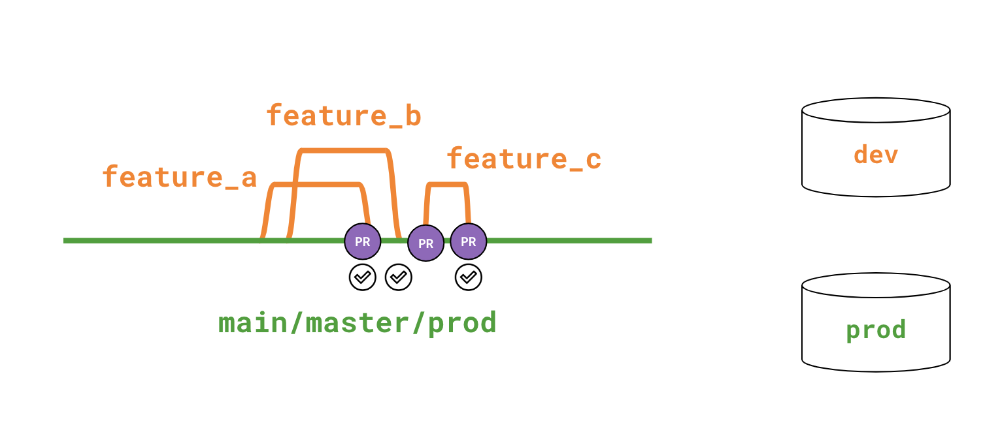

# 8 - Advanced Deployment

# Introduction

### **Environments, jobs, and runs**

**Environments** encompass a collection of settings for how you want to run your dbt project. This includes:

- dbt version
- git branch
- data location (target schema)

The **development environment** applies the same settings for all developers working in dbt Cloud. **Deployment environments** can be set up to support various different deployment strategies and architectures (more on that later in the course.)

**Jobs** are a set of dbt commands that you run within an environment. This can include commands like **dbt build** with any selection syntax / flags that you may want. These jobs can then be kicked off through a variety of means covered in the rest of this course.

**Runs** are the implementation of a specific job that you have configured that was triggered. While a job is running, you can see that status of that job in real time. Once the job is finished, you can see the run results and view artifacts from that particular run.

### **Related resources**

- [dbt docs: Environments](https://docs.getdbt.com/docs/collaborate/environments)

# **Introduction to Advanced Deployment**

### **1 trunk / direct promotion**

The **1 trunk / direction promotion** approach involves the following:

- Developer branch off of the main branch.
- After developing, they open a pull / merge request.
- This kicks off a CI job that builds and tests the dbt code in a temporary PR schema.
- After code review and CI checks pass, the code can merged into main.

This approach is the recommended approach for most use-cases as it allows changes to code to be quickly moved to production, with confidence that they can be trusted.

### **2+ trunk / indirect promotion**

The **2+ trunk / indirection promotion** approach involves the following:

- The code owner creates 1 or many qa branches off of main
- Developer branch off of the qa branch
- After developing, they open a pull / merge request against the qa branch
- This kicks off a CI job that builds and tests the dbt code in a temporary PR schema.
- After code review and CI checks pass, the code can merged into qa.
- The core owner then manages the merging of code from qa to the main branch through another CI process.

This approach can be helpful if your team wants to release changes in batches rather than immediately. This provides a middle branch/environment where user acceptance testing can be applied, though might slow down the time for getting new features into production.

### **Related resources**

[dbt Blog: Adopting CI/CD with dbt Cloud](https://www.getdbt.com/blog/adopting-ci-cd-with-dbt-cloud/)

## Questions

---

---

---

---

---

# **Job structures**

### **dbt build**

**dbt build** is a smart combination of **dbt run** and **dbt** **test** that will also build your snapshots and seeds. All of this is done in DAG order from left to right. This is particularly helpful for **only continuing** to build your DAG downstream from a node if the tests pass on that node.

### **Common deployment jobs**

We covered four common deployment jobs:

**Standard job -** this jobs is typically just **dbt build** and will rebuild your entire DAG while **including** incremental logic.

**Full refresh job -** this job similar will use **dbt build** except it will pass the full refresh flag. This will force incremental models to be dropped and materialized from scratch and seeds to be dropped and rebuilt as well.

**Time sensitive** - this is a job that usually has a time sensitive business use case. You might consider refreshing marketing data or sales data more frequently than your standard job. You can accomplish this by using model selector syntax with your commands.

**Fresh rebuild** - fresh rebuild allows you to **only** rebuild models downstream from sources that have been updated since the previous run.

### **One off vs. unified jobs**

There are chances that you have jobs that run at the same time and rebuild some share resources. In these cases, it can be helpful to use model selector syntax that allows you to select the intersection or union of models rather than running jobs individually.

### **Related resources**

- [dbt docs: Node selection syntax](https://docs.getdbt.com/reference/node-selection/syntax)
- [dbt docs: Fresh rebuilds](https://docs.getdbt.com/docs/deploy/cloud-ci-job#fresh-rebuilds)

### Questions

---

---

---

---

---

# **Orchestration**

### **Scheduling options in dbt Cloud**

There are 3 major ways to trigger a job in dbt Cloud:

- **Schedule** - you can configure a schedule for a job to run directly within the dbt Cloud UI. You can set this through a user friendly UI or in a more customizable way with cron syntax.
- **Webhook** - you can trigger a job with a webhook from your git provider. Currently dbt Cloud supports GitHub, Gitlab, and Azure Devops.
- **API Call** If you are using an external orchestrator such as Airflow, you can call dbt Cloud directly to initiate an job through an API call. This will require either a service token or user token.

### **Reviewing past runs**

When a run completes, you can view several things about that particular run

- Model timing
- Run logs
- Artifacts including json files and compiled SQL
- Documentation (if configured)
- Source freshness (if configured)

### **Coordinating different jobs**

There are cases where you may have jobs that run concurrently on shared models. In these cases, you likely want to account for those conflicts. This can be difficult to achieve with the user friendly scheduling options. To avoid these conflict, consider using cron syntax or API calls to avoid the overlapping jobs.

### **Related resources**

- [dbt guides: Airflow and dbt Cloud](https://docs.getdbt.com/guides/orchestration/airflow-and-dbt-cloud/1-airflow-and-dbt-cloud)

### Questions

---

---

---

---

---

# **Continuous Integration**

### **Continuous Integration and Slim CI**

**Continuous integration** traditionally is a devops practice for running automated checks on your code changes before merging into another branch. In the context of dbt, you can leverage CI to ensure that you models build and pass your assertions before merging them into your main branch.

**Slim CI** refers to smart way of running a CI build by only building and testing models that have been updated and those downstream of them.

### **Related resources**

- [dbt docs: dbt Cloud CI Job](https://docs.getdbt.com/docs/deploy/cloud-ci-job#understanding-dbt-cloud-slim-ci)

### Questions

---

---

---

---

---

# **Custom environment and job behavior**

### **Customizing behavior in dbt Cloud**

There will be cases where you want to have dbt behave differently between environments. Within the dbt context there are two key variables for achieving this:

- **target variable** - the target variable can be set on the job or environment level. This can then be included in your dbt project to tweak the logic dbt handles based on your environment.
- **environment variable** - environment variables are set on the environment level and can be referenced in your dbt Cloud project to modify the behavior of dbt. Environment variables also support secrets in case you need to leverage variables that should not be exposed throughout the logs or the UI.

### **Related resources**

- [dbt docs: Environment variables](https://docs.getdbt.com/docs/build/environment-variables)

### Questions

---

---

---

---

---
